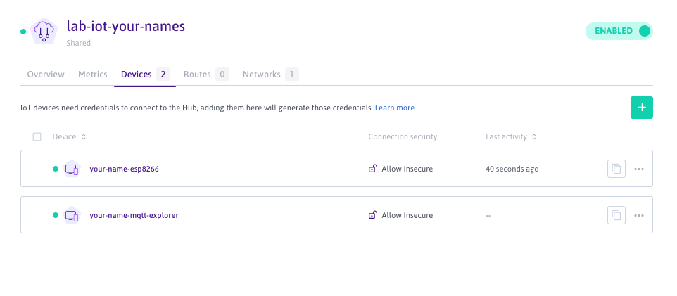

# IoT Communication Protocols - Lab 1

Laboratory for IoT Communication Protocols classes - Using NodeMCU ESP8266, MQTT, NodeRED and [Scaleway](https://www.scaleway.com/en/elements/) - Version 2020

## About this lab

The goal of this lab is to get familiar with the IoT keychain value: **From the device to the cloud** 

We will be using:

- On the microcontroller side, a NodeMCU ESP8266.
Please see the previous lab for more information on how to use this microcontroller: [Embedded Programming - Lab 1](https://github.com/luisomoreau/Embedded-Programming-Lab-1).

- WIFI as the wireless transportation protocol. Your school wifi router or your phone in a hubspot mode will act as a gateway. 

- MQTT as the data communication protocol to transmit information between the device and the cloud.
 
- [Scaleway](https://www.scaleway.com/en/elements/) as a Cloud Provider with their MQTT managed message broker (the [IoT Hub](https://www.scaleway.com/en/iot-hub/)) and their [Development Instances](https://www.scaleway.com/en/virtual-instances/development/) to host the NodeRED application.

### Grades

Where you will see:

✏️  **Step X: For the graded part, take a screenshot, a picture or save your code**

Please, add the screenshot or your code under the `/graded-assignement` folder.
Name your screenshot, your picture or your code folder with the step number.
Example: `graded-assignement/screenshots/step1.png` 

### Prerequisites

I assume that you all have the Arduino IDE installed and setup to be compatible with the NodeMCU microcontroller. If not, please see the previous lab: [Embedded Programming - Lab 1](https://github.com/luisomoreau/Embedded-Programming-Lab-1).

### Warnings 

When manipulating the LEDs, please add a small resistor.

Never wire the 3.3V with the GND pins, you may destroy the microcontroller. 

If you are not sure about what to do, just ask me :) 

## About MQTT

**Message Queuing Telemetry Transport** (MQTT) is a **publish/subscribe** messaging protocol that allows two remote devices to communicate via messages **asynchronously** with **low bandwidth**. The protocol, specifically dedicated to the world of M2M (machine to machine) and IoT (Internet of Things), has now become a standard.

At the heart of a standard MQTT based IoT structure, there is a remote server, the **Broker**. All objects and services connect to it as **clients**. The broker forwards messages between clients. Clients can send messages as **publishers** and receive messages as **subscribers**. Published messages contain a topic which describes the message's contents (for example: weather in Paris, France). Subscribers each receive a copy of the message if they have subscribed to the topic of the published message.

On the above illustration, the subscribers subscribe to a topic at the broker (Scaleway IoT Hub) (1), the publisher publishes information in the topic to the broker (2) and the broker publishes the topic to the subscribers (3)

In MQTT, clients identify themselves using a unique **ClientID**. If left empty the Broker will generate a random one.

When a client connects to a Broker, it can choose to start a new session or resume the existing one. A session contains clients' subscriptions and pending messages.

Topics are used to forward published messages to subscribers. The term **topic** in MQTT refers to a simple UTF-8 string that the broker uses to dispatch messages to subscribers. Topics can consist of one or several _topic levels_, each of them separated by a forward slash - referenced as _topic level separator_.  A topic can be, for example, `fr/paris/weather/temperature` for the temperature in Paris, France.

Topics are case sensitive and must contain at least one character. This means that `fr/Paris/Weather/Temperature` refers to a different topic than `fr/paris/weather/temperature`.

Other valid examples for topics could be: 

- `compute/instance/f97d95cd-b349-4bee-9ac8-92e12542d4e9/status`
- `myhome/first-floor/bedroom/temperature`
- `Bavaria/Munich/Marienplatz`

## Get started with Scaleway IoT Hub

### Join the Classroom organisation

By now, you should have receive an invitation by email to join the Scaleway's `Classroom` Organization:

Accept the invitation, you will be redirected to the [Scaleway Console](https://console.scaleway.com/):

### Create an IoT Hub

Go to the [IoT Hub](https://console.scaleway.com/iot-hub/hubs) tab:

Create your first Hub and choose the `Free SHARED` Plan:

Click on `create`, your hub will be ready in few seconds:

✏️  **Step 1: For the graded part, take a screenshot here of your hub**

### Add a device

Once your hub is created, you should see the following screen:

Navigate to the Device tab:

Click on `Add Devices`:

Before validating, choose the `Deny Insecure` option, we won't use devices certificates in the tutorial.

To check your device information, just click on its name, you should see the following screen:

Your MQTT broker is now ready to receive some physical device information!

Now repeat this step to create a second device:

✏️  **Step 2: For the graded part, take a screenshot here of your device**

## MQTT Explorer

MQTT Explorer is a comprehensive MQTT client that provides a structured overview of your MQTT topics and makes working with devices/services on your broker dead-simple.

To install a lightweight MQTT, just download it here: [http://mqtt-explorer.com/](http://mqtt-explorer.com/)

Open MQTT Explorer and fill the following information:

Host: `iot.fr-par.scw.cloud`
Username: `your-device-id`

Click on Connect, you should see the following screen:

## Microcontroller

### Wiring

Perform the following wiring:

Here is the pinout table:

| Pin Names on NodeMCU Development Kit| ESP8266 Internal GPIO Pin number|
| ------------- |:-------------:| 
|D0|GPIO16|
|D1|GPIO5|
|D2|GPIO4|
|D3|GPIO0|
|D4|GPIO2|
|D5|GPIO14|
|D6|GPIO12|
|D7|GPIO13|
|D8|GPIO15|
|D9/RX|GPIO3|
|D10/TX|GPIO1|
|D11/SD2|GPIO9|
|D12/SD3|GPIO10|

✏️  **Step 3: For the graded part, take a picture of your wiring**

### Embedded Code

#### Arduino IDE

Again, if you have not installed the Arduino IDE and set it up correctly to be compatible with the NodeMCU ESP8266 microcontroller, please check out the previous lab: [Embedded Programming - Lab 1](https://github.com/luisomoreau/Embedded-Programming-Lab-1).

#### Libraries

We will use the following Libraries:

* [PubSubClient library](https://github.com/knolleary/pubsubclient/archive/master.zip): The PubSubClient library provides a client for doing simple publish/subscribe messaging with a server that supports MQTT (basically allows your ESP8266 to talk with your MQTT Broker).

* [DHT sensor library](https://github.com/adafruit/DHT-sensor-library/archive/master.zip): The DHT sensor library provides an easy way of using any DHT sensor to read temperature and humidity with your ESP8266 or Arduino boards.

They are included in this Github repository under the `libraries` folder. 

To import them, you can go to **Sketch > Include Library > Add . ZIP library** and select the library

## Connecting your ESP8266 to Scaleway IoT Hub

Create a first program (arduino sketch) to connect to your IoT Hub:

## Flow Programming with NodeRED

