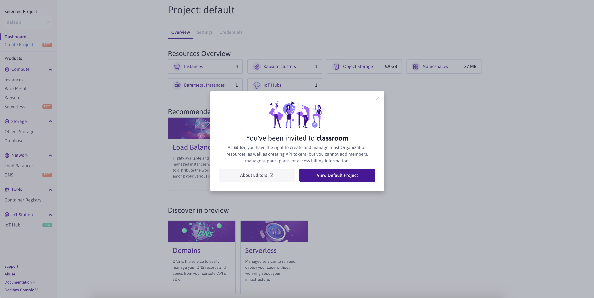
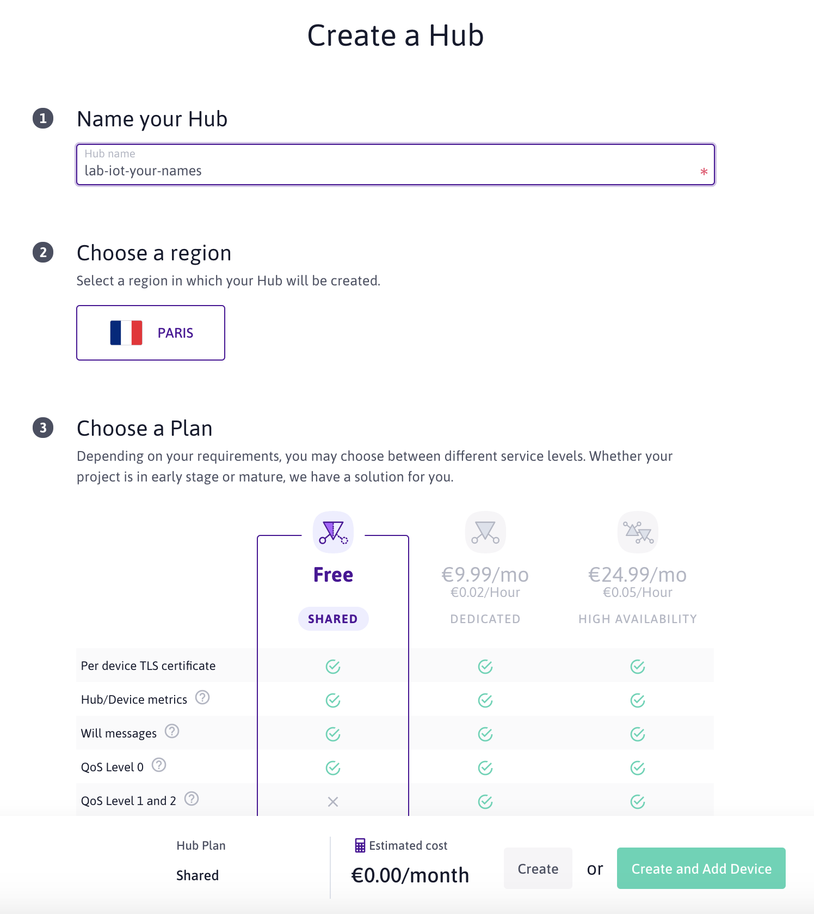

# IoT Communication Protocols - Lab 1

Laboratory for IoT Communication Protocols classes - Using NodeMCU ESP8266, MQTT, NodeRED and [Scaleway](https://www.scaleway.com/en/elements/) - Version 2020

## About this lab

The goal of this lab is to get familiar with the IoT keychain value: **From the device to the cloud** 

We will be using:

- On the microcontroller side, a NodeMCU ESP8266.
Please see the previous lab for more information on how to use this microcontroller: [Embedded Programming - Lab 1](https://github.com/luisomoreau/Embedded-Programming-Lab-1).

- WIFI as the wireless transportation protocol. Your school wifi router or your phone in a hubspot mode will act as a gateway. 

- MQTT as the data communication protocol to transmit information between the device and the cloud.
 
- [Scaleway](https://www.scaleway.com/en/elements/) as a Cloud Provider with their MQTT managed message broker (the [IoT Hub](https://www.scaleway.com/en/iot-hub/)) and their [Development Instances](https://www.scaleway.com/en/virtual-instances/development/) to host the NodeRED application.

### Grades

### Prerequisites

I assume that you all have the Arduino IDE installed and setup to be compatible with the NodeMCU microcontroller. If not, please see the previous lab: [Embedded Programming - Lab 1](https://github.com/luisomoreau/Embedded-Programming-Lab-1).

### Warnings 

When manipulating the LEDs, please add a small resistor.

Never wire the 3.3V with the GND pins, you may destroy the microcontroller. 

If you are not sure about what to do, just ask me :) 

## About MQTT

**Message Queuing Telemetry Transport** (MQTT) is a **publish/subscribe** messaging protocol that allows two remote devices to communicate via messages **asynchronously** with **low bandwidth**. The protocol, specifically dedicated to the world of M2M (machine to machine) and IoT (Internet of Things), has now become a standard.

At the heart of a standard MQTT based IoT structure, there is a remote server, the **Broker**. All objects and services connect to it as **clients**. The broker forwards messages between clients. Clients can send messages as **publishers** and receive messages as **subscribers**. Published messages contain a topic which describes the message's contents (for example: weather in Paris, France). Subscribers each receive a copy of the message if they have subscribed to the topic of the published message.

On the above illustration, the subscribers subscribe to a topic at the broker (Scaleway IoT Hub) (1), the publisher publishes information in the topic to the broker (2) and the broker publishes the topic to the subscribers (3)

In MQTT, clients identify themselves using a unique **ClientID**. If left empty the Broker will generate a random one.

When a client connects to a Broker, it can choose to start a new session or resume the existing one. A session contains clients' subscriptions and pending messages.

Topics are used to forward published messages to subscribers. A **topic** is a character string indicating the message's contents (example: `home/2ndfloor/kitchen/temperature`). With MQTT, by default, all subscribers receive a copy of the messages published with matching topics.

## Get started with Scaleway IoT Hub

By now, you should have receive an invitation to join the Scaleway Classroom Organization:

Accept the invitation, you will be redirected to the [Scaleway Console](https://console.scaleway.com/):

Go to the [IoT Hub](https://console.scaleway.com/iot-hub/hubs) tab:

Create your first Hub and choose the Shared Plan:

Click on `create`, your hub will be ready in few seconds:

## Microcontroller

## Connecting your ESP8266 to Scaleway IoT Hub

