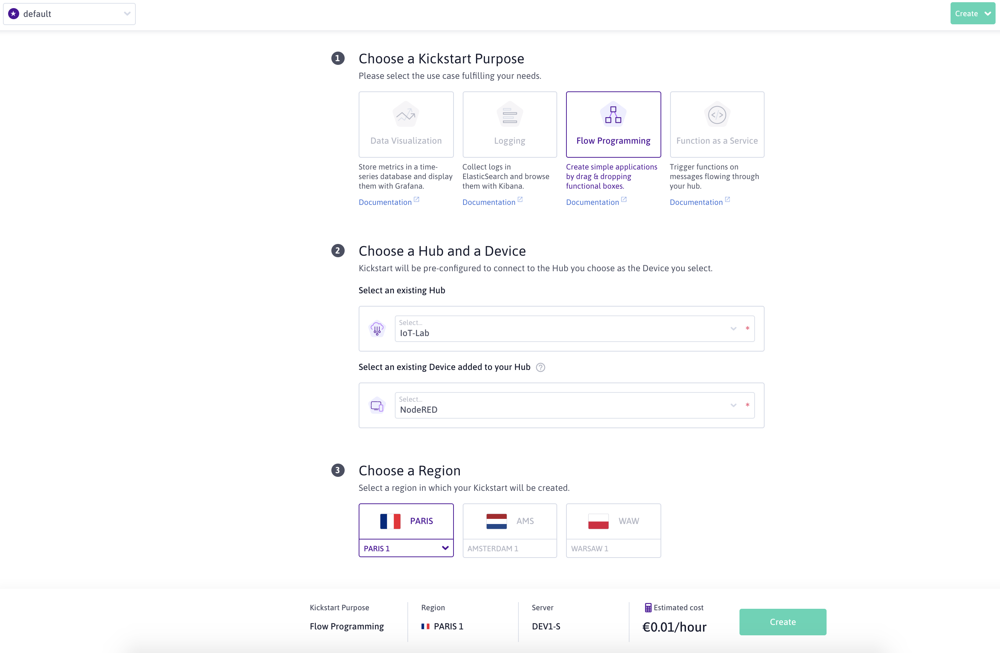

# IoT Communication Protocols - Lab 1

Laboratory for IoT Communication Protocols classes - Using NodeMCU ESP8266, MQTT, Node-RED and [Scaleway](https://www.scaleway.com/en/elements/) - Version 2020

## About this lab

The goal of this lab is to get familiar with the IoT keychain value: **From the device to the cloud** 

We will be using:

- On the microcontroller side, a NodeMCU ESP8266.
Please see the previous lab for more information on how to use this microcontroller: [Embedded Programming - Lab 1](https://github.com/luisomoreau/Embedded-Programming-Lab-1).

- WIFI as the wireless transportation protocol. Your school wifi router or your phone in a hubspot mode will act as a gateway. 

- MQTT as the data communication protocol to transmit information between the device and the cloud.
 
- [Scaleway](https://www.scaleway.com/en/elements/) as a Cloud Provider with their MQTT managed message broker (the [IoT Hub](https://www.scaleway.com/en/iot-hub/)) and their [Development Instances](https://www.scaleway.com/en/virtual-instances/development/) to host the Node-RED application.

### Grades

Where you will see:

✏️  **Step X: For the graded part, take a screenshot, a picture or save your code**

Please, add the screenshot or your code under the `/graded-assignement` folder.
Name your screenshot, your picture or your code folder with the step number.
Example: `graded-assignement/screenshots/step1.png` 

### Prerequisites

I assume that you all have the Arduino IDE installed and setup to be compatible with the NodeMCU microcontroller. If not, please see the previous lab: [Embedded Programming - Lab 1](https://github.com/luisomoreau/Embedded-Programming-Lab-1).

### Warnings 

When manipulating the LEDs, please add a small resistor.

Never wire the 3.3V with the GND pins, you may destroy the microcontroller. 

If you are not sure about what to do, just ask me :) 

## About MQTT

**Message Queuing Telemetry Transport** (MQTT) is a **publish/subscribe** messaging protocol that allows two remote devices to communicate via messages **asynchronously** with **low bandwidth**. The protocol, specifically dedicated to the world of M2M (machine to machine) and IoT (Internet of Things), has now become a standard.

At the heart of a standard MQTT based IoT structure, there is a remote server, the **Broker**. All objects and services connect to it as **clients**. The broker forwards messages between clients. Clients can send messages as **publishers** and receive messages as **subscribers**. Published messages contain a topic which describes the message's contents (for example: weather in Paris, France). Subscribers each receive a copy of the message if they have subscribed to the topic of the published message.


On the above illustration, the subscribers subscribe to a topic at the broker (Scaleway IoT Hub) (1), the publisher publishes information in the topic to the broker (2) and the broker publishes the topic to the subscribers (3)

In MQTT, clients identify themselves using a unique **ClientID**. If left empty the Broker will generate a random one.

When a client connects to a Broker, it can choose to start a new session or resume the existing one. A session contains clients' subscriptions and pending messages.

Topics are used to forward published messages to subscribers. The term **topic** in MQTT refers to a simple UTF-8 string that the broker uses to dispatch messages to subscribers. Topics can consist of one or several _topic levels_, each of them separated by a forward slash - referenced as _topic level separator_.  A topic can be, for example, `fr/paris/weather/temperature` for the temperature in Paris, France.

Topics are case sensitive and must contain at least one character. This means that `fr/Paris/Weather/Temperature` refers to a different topic than `fr/paris/weather/temperature`.


Other valid examples for topics could be: 

- `compute/instance/f97d95cd-b349-4bee-9ac8-92e12542d4e9/status`
- `myhome/first-floor/bedroom/temperature`
- `Bavaria/Munich/Marienplatz`


## Get started with Scaleway IoT Hub

### Join the Classroom organisation

By now, you should have receive an invitation by email to join the Scaleway's `Classroom` Organization:


Accept the invitation, you will be redirected to the [Scaleway Console](https://console.scaleway.com/):


### Create an IoT Hub

Go to the [IoT Hub](https://console.scaleway.com/iot-hub/hubs) tab:


Create your first Hub and choose the `Free SHARED` Plan:


Click on `create`, your hub will be ready in few seconds:


✏️  **Step 1: For the graded part, take a screenshot here of your hub**

### Add a device

Once your hub is created, you should see the following screen:


Navigate to the Device tab:


Click on `Add Devices`:


Before validating, choose the `Deny Insecure` option, we won't use devices certificates in the tutorial.


To check your device information, just click on its name, you should see the following screen:


Your MQTT broker is now ready to receive some physical device information!

Now repeat this step to create a two other devices:


✏️  **Step 2: For the graded part, take a screenshot here of your device**

## MQTT Explorer

MQTT Explorer is a comprehensive MQTT client that provides a structured overview of your MQTT topics and makes working with devices/services on your broker dead-simple.

To install a lightweight MQTT, just download it here: [http://mqtt-explorer.com/](http://mqtt-explorer.com/)

Open MQTT Explorer and fill the following information:

Host: `iot.fr-par.scw.cloud`
Username: `your-device-id`


Click on Connect, you should see the following screen:


✏️  **Step 3: For the graded part, take a screenshot here of the MQTT Explorer connected**

## Microcontroller

#### Arduino IDE

Again, if you have not installed the Arduino IDE and set it up correctly to be compatible with the NodeMCU ESP8266 microcontroller, please check out the previous lab: [Embedded Programming - Lab 1](https://github.com/luisomoreau/Embedded-Programming-Lab-1).


#### Libraries

We will use the following Libraries:

* [PubSubClient library](https://github.com/knolleary/pubsubclient/archive/master.zip): The PubSubClient library provides a client for doing simple publish/subscribe messaging with a server that supports MQTT (basically allows your ESP8266 to talk with your MQTT Broker).


* [DHT sensor library](https://github.com/adafruit/DHT-sensor-library/archive/master.zip): The DHT sensor library provides an easy way of using any DHT sensor to read temperature and humidity with your ESP8266 or Arduino boards.

They are included in this Github repository under the `libraries` folder. 

To import them, you can go to **Sketch > Include Library > Add . ZIP library** and select the library


## First Program: Connecting your ESP8266 to Scaleway IoT Hub

Create a first program (arduino sketch) to connect to your IoT Hub:

PubSubClient library allows us to publish/subscribe messages in topics. Add theses lignes at the begining of your sketch:

```
#include <ESP8266WiFi.h>
#include <PubSubClient.h>
```

Now declare some global variables for our WiFi and MQTT connections. Enter your WiFi and MQTT details in below variables:

```
const char* ssid = "WiFi Name"; // Enter your WiFi name
const char* password =  "WiFi Password"; // Enter WiFi password
const char* mqttServer = "iot.fr-par.scw.cloud";
const int mqttPort = 1883;
const char* mqttUser = "your-device-id";
const char* mqttPassword = "";

WiFiClient espClient;
PubSubClient client(espClient);
```

In the setup function, it will check the WiFi, whether it is connected to network or not and print it on the serial monitor.

```
void setup() {
  Serial.begin(115200);
  WiFi.begin(ssid, password);
  while (WiFi.status() != WL_CONNECTED) {
​​​​​    delay(500);
    Serial.println("Connecting to WiFi..");
  }
  Serial.println("Connected to the WiFi network");
  
  client.setServer(mqttServer, mqttPort);
  client.setCallback(callback);
```

In the below, while loop function, it will connect to the MQTT server and will print it on the serial monitor. This process will run in a loop until it gets connected.

```
while (!client.connected()) {
    Serial.println("Connecting to MQTT...");
    if (client.connect("ESP8266Client", mqttUser, mqttPassword )) {
      Serial.println("connected"); 
    } else {

      Serial.print("failed with state ");
      Serial.print(client.state());
      delay(2000);
    }
}
```

Now to check the setup function it will it will publish and subscribe a message on topic and for that it will use publish and subscribe method.

```
  Serial.println("Sending payload hello-world...");
  client.publish("esp/test", "hello-world"); //Topic name
  Serial.println("Payload sent!");
  client.subscribe("esp/test");
}  
```

Now we will specify a call back function and in this function, we will first print the topic name and then received message.

```
void callback(char* topic, byte* payload, unsigned int length) {
 
  Serial.print("Message arrived in topic: ");
  Serial.println(topic);
 
  Serial.print("Message:");
  for (int i = 0; i < length; i++) {
    Serial.print((char)payload[i]);
  }
 
  Serial.println();
  Serial.println("-----------------------");
 
}
```

Finish by adding in the loop:

```
void loop() {
  client.loop();
}
```

Upload your code to your ESP8266 microcontroller:

You should see the following console results:


✏️  **Step 4: For the graded part, take a screenshot here of the console**

Go back to your IoT Hub, some message should arrive:


✏️  **Step 5: For the graded part, take a screenshot here of your hub receiving messages**

You should also see the messages arriving in the MQTT Explorer tool:


✏️  **Step 6: For the graded part, take a screenshot here of the MQTT Explorer connected with a payload received**

✏️  **Step 7: For the graded part, add save your code as `first-program.ino`**


## Control a LED and display temperature: 

Flow Programming with Node-RED + Arduino
Here we will use a LED and a DHT11 sensor. We will also need a small resistor. 330 ohms - higher resistors can also be used, it will just make the LED less bright.

### Wiring

Perform the following wiring:


Here is the pinout table:

| Pin Names on NodeMCU Development Kit| ESP8266 Internal GPIO Pin number|
| ------------- |:-------------:| 
|D0|GPIO16|
|D1|GPIO5|
|D2|GPIO4|
|D3|GPIO0|
|D4|GPIO2|
|D5|GPIO14|
|D6|GPIO12|
|D7|GPIO13|
|D8|GPIO15|
|D9/RX|GPIO3|
|D10/TX|GPIO1|
|D11/SD2|GPIO9|
|D12/SD3|GPIO10|

✏️  **Step 8: For the graded part, take a picture of your wiring**


### Second Program - Humidity and Temperature

Create a new Arduino Sketch and add the following code:

```
#include <ESP8266WiFi.h>
#include <PubSubClient.h>
#include "DHT.h"

#define DHTTYPE DHT11     // DHT 11

// Change the credentials below, so your ESP8266 connects to your router
const char* ssid = "YOUR_WIFI_NAME";
const char* password = "YOUR_WIFI_PASSWORD";

// Change the variable to your MQTT Broker, so it connects to it
const char* mqttServer = "iot.fr-par.scw.cloud";
const int mqttPort = 1883;
const char* mqttUser = "YOUR_DEVICE_ID";
const char* mqttPassword = "";

// Initializes the espClient. You should change the espClient name if you have multiple ESPs running in your home automation system
WiFiClient espClient;
PubSubClient client(espClient);

// DHT Sensor - GPIO 5 = D1 on ESP-12E NodeMCU board
const int DHTPin = 15;

// Lamp - LED - GPIO 2 = D4 on ESP-12E NodeMCU board
const int lamp = 2;

// Initialize DHT sensor.
DHT dht(DHTPin, DHTTYPE);

// Timers auxiliar variables
long now = millis();
long lastMeasure = 0;

// Don't change the function below. This functions connects your ESP8266 to your router
void setup_wifi() {
  delay(10);
  // We start by connecting to a WiFi network
  Serial.println();
  Serial.print("Connecting to ");
  Serial.println(ssid);
  WiFi.begin(ssid, password);
  while (WiFi.status() != WL_CONNECTED) {
    delay(500);
    Serial.print(".");
  }
  Serial.println("");
  Serial.print("WiFi connected - ESP IP address: ");
  Serial.println(WiFi.localIP());
}

// This functions is executed when some device publishes a message to a topic that your ESP8266 is subscribed to
// Change the function below to add logic to your program, so when a device publishes a message to a topic that 
// your ESP8266 is subscribed you can actually do something
void callback(String topic, byte* message, unsigned int length) {
  Serial.print("Message arrived on topic: ");
  Serial.print(topic);
  Serial.print(". Message: ");
  String messageTemp;
  
  for (int i = 0; i < length; i++) {
    Serial.print((char)message[i]);
    messageTemp += (char)message[i];
  }
  Serial.println();

  // Feel free to add more if statements to control more GPIOs with MQTT

  // If a message is received on the topic room/lamp, you check if the message is either on or off. Turns the lamp GPIO according to the message
  if(topic=="room/lamp"){
      Serial.print("Changing Room lamp to ");
      if(messageTemp == "on"){
        digitalWrite(lamp, HIGH);
        Serial.print("On");
      }
      else if(messageTemp == "off"){
        digitalWrite(lamp, LOW);
        Serial.print("Off");
      }
  }
  Serial.println();
}

// This functions reconnects your ESP8266 to your MQTT broker
// Change the function below if you want to subscribe to more topics with your ESP8266 
void reconnect() {
  // Loop until we're reconnected
  while (!client.connected()) {
    Serial.print("Attempting MQTT connection...");
    // Attempt to connect
    if (client.connect("ESP8266Client", mqttUser, mqttPassword )) {
      Serial.println("connected");  
      // Subscribe or resubscribe to a topic
      // You can subscribe to more topics (to control more LEDs in this example)
      client.subscribe("room/lamp");
    } else {
      Serial.print("failed, rc=");
      Serial.print(client.state());
      Serial.println(" try again in 5 seconds");
      // Wait 5 seconds before retrying
      delay(5000);
    }
  }
}

// The setup function sets your ESP GPIOs to Outputs, starts the serial communication at a baud rate of 115200
// Sets your mqtt broker and sets the callback function
// The callback function is what receives messages and actually controls the LEDs
void setup() {
  pinMode(lamp, OUTPUT);
  
  dht.begin();
  
  Serial.begin(115200);
  setup_wifi();
  client.setServer(mqttServer, mqttPort);
  client.setCallback(callback);

}

// For this project, you don't need to change anything in the loop function. Basically it ensures that you ESP is connected to your broker
void loop() {

  if (!client.connected()) {
    reconnect();
  }
  if(!client.loop())
    client.connect("ESP8266Client", mqttUser, mqttPassword );

  now = millis();
  // Publishes new temperature and humidity every 30 seconds
  if (now - lastMeasure > 30000) {
    lastMeasure = now;
    // Sensor readings may also be up to 2 seconds 'old' (its a very slow sensor)
    float h = dht.readHumidity();
    // Read temperature as Celsius (the default)
    float t = dht.readTemperature();
    // Read temperature as Fahrenheit (isFahrenheit = true)
    float f = dht.readTemperature(true);

    // Check if any reads failed and exit early (to try again).
    if (isnan(h) || isnan(t) || isnan(f)) {
      Serial.println("Failed to read from DHT sensor!");
      return;
    }

    // Computes temperature values in Celsius
    float hic = dht.computeHeatIndex(t, h, false);
    static char temperatureTemp[7];
    dtostrf(hic, 6, 2, temperatureTemp);
    
    // Uncomment to compute temperature values in Fahrenheit 
    // float hif = dht.computeHeatIndex(f, h);
    // static char temperatureTemp[7];
    // dtostrf(hic, 6, 2, temperatureTemp);
    
    static char humidityTemp[7];
    dtostrf(h, 6, 2, humidityTemp);

    // Publishes Temperature and Humidity values
    client.publish("room/temperature", temperatureTemp);
    client.publish("room/humidity", humidityTemp);
    
    Serial.print("Humidity: ");
    Serial.print(h);
    Serial.print(" %\t Temperature: ");
    Serial.print(t);
    Serial.print(" *C ");
    Serial.print(f);
    Serial.print(" *F\t Heat index: ");
    Serial.print(hic);
    Serial.println(" *C ");
    // Serial.print(hif);
    // Serial.println(" *F");
  }
} 
```

You should see the following console output:


### Flow Programming

Go back to your IoT Hub and go to the [Kickstart](https://console.scaleway.com/iot-hub/kickstarts/create) tab:


Click on `+ Create a Kickstart`

Fill the following form:



validate by clicking on `Create a Kickstart`.

Now wait few seconds until your application is getting ready. When ready, a green indicator will appear:


Now click on `Dashboard` and log with:

- Username: `admin`
- Password: `your-password`

After you logged in successfully, this screen will be displayed:


Start by adding some new type of nodes:


Find the `node-red-dashboard` and install it:


Create a Layout as followed:


Add the following nodes to a new Flow:


- switch – this will control the ESP8266 output
- mqtt output node – this will publish a message to the ESP8266 accordingly to the switch state
- 2x mqtt input nodes – this nodes will be subscribed to the temperature and humidity topics to receive sensor data from the ESP
- chart – will display the temperature sensor readings
- gauge – will display the humidity sensor readings


**MQTT Out**
Node-RED and the MQTT broker need to be connected. To connect the MQTT broker to Node-RED, double-click the MQTT output node. A new window pops up – as shown in figure below.
Make sur it is already pre-configured, just add the `Topic` and the `Name`:


**Switch**
Now edit the switch node as below:


**MQTT In**

Update the MQTT in for the `Temperature` and the `Humidity`


**Chart**


**Gauge**


**Link the nodes**


Finally, click on deploy:


✏️  **Step 9: For the graded part, take a screenshot here**

Open a new browser tab with this url: `http://your-ip:1880/ui/`

You should see a nice dashboard:


✏️  **Step 10: For the graded part, take a screenshot here**

